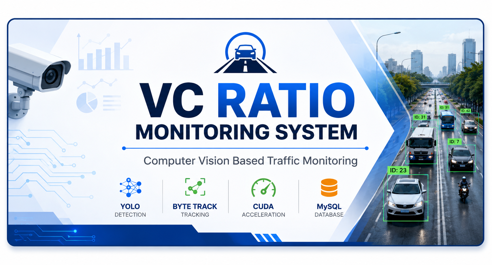
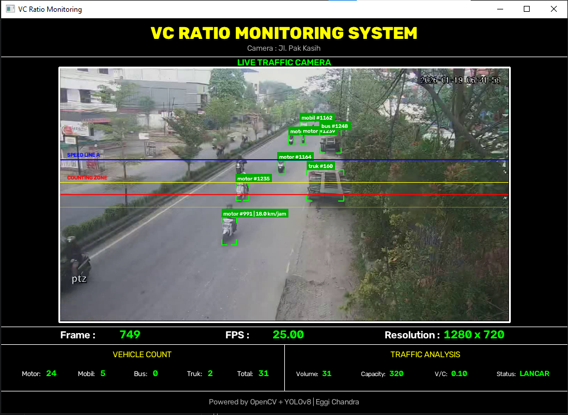
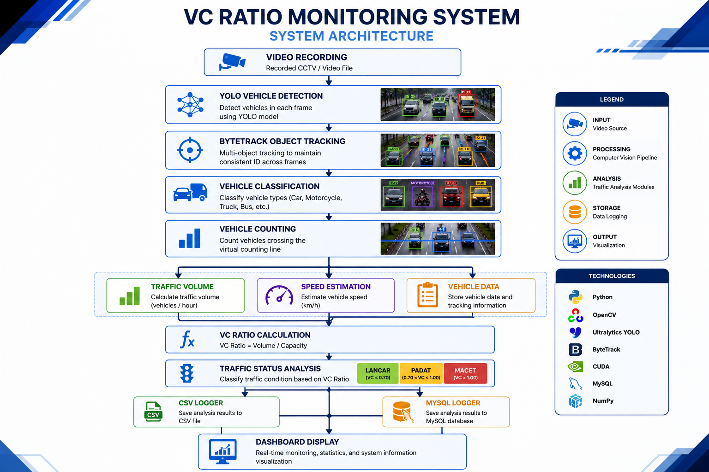

# 🚦 VC Ratio Monitoring System




# 🖼 Dashboard Preview



Computer Vision based Traffic Monitoring System for vehicle detection, tracking, traffic analysis, and VC Ratio calculation using **YOLO**, **OpenCV**, and **Python**.

This project is being developed as a prototype for traffic monitoring and analysis, with future deployment planned for the Transportation Department (Dinas Perhubungan).

---

# 📌 Project Overview

The system processes recorded CCTV video to automatically:

- Detect vehicles
- Track vehicle movement
- Count traffic volume
- Calculate VC Ratio
- Estimate vehicle speed
- Analyze traffic conditions
- Store analysis results into MySQL database

The application is designed using a modular architecture to simplify maintenance and future development.

---

# ✨ Current Features

## 🚗 Computer Vision

- ✅ YOLO Vehicle Detection
- ✅ ByteTrack Multi Object Tracking
- ✅ Vehicle Classification
- ✅ Bounding Box Visualization
- ✅ Tracking ID Management

---

## 📊 Traffic Analysis

- ✅ Vehicle Counting
- ✅ Traffic Volume Calculation
- ✅ Road Capacity
- ✅ VC Ratio Calculation
- ✅ Traffic Status Classification
- ✅ Vehicle Speed Estimation

---

## 💾 Data Logging

- ✅ CSV Export
- ✅ MySQL Database Logger
- ✅ Benchmark Result Logging

---

## ⚡ Performance

- ✅ CUDA GPU Acceleration
- ✅ Multi Model Benchmark
- ✅ YOLOv8s Benchmark
- ✅ YOLOv8m Benchmark
- ✅ YOLO11 Benchmark

---

## 🖥 Dashboard

- ✅ Professional Dashboard Layout
- ✅ Camera Display
- ✅ Traffic Statistics
- ✅ Vehicle Information
- ✅ System Information

---

# 🏗 System Architecture



The system follows a modular processing pipeline consisting of:

1. Video Recording Input
2. YOLO Vehicle Detection
3. ByteTrack Object Tracking
4. Vehicle Classification
5. Vehicle Counting
6. Traffic Volume Analysis
7. Speed Estimation
8. VC Ratio Calculation
9. Traffic Status Analysis
10. CSV & MySQL Logging
11. Dashboard Visualization

---

# 📂 Project Structure

```text
VC-Ratio-Monitoring-System
│
├── benchmark/
├── data/
├── docs/
├── models/
├── output/
├── tools/
│
├── src/
│   ├── main.py
│   ├── config.py
│   ├── hardware.py
│   ├── processing.py
│   ├── draw.py
│   ├── layout.py
│   ├── yolo_detector.py
│   ├── tracker.py
│   ├── vehicle_tracker.py
│   ├── line_counter.py
│   ├── speed_estimator.py
│   ├── csv_logger.py
│   ├── database_logger.py
│   ├── database_logger_sqlite.py
│   └── utils.py
│
├── requirements.txt
└── README.md
```

---

# 🛠 Technologies

- Python 3.12
- OpenCV
- Ultralytics YOLO
- ByteTrack
- PyTorch
- CUDA
- MySQL
- NumPy
- Git
- GitHub

---

# 🚀 Installation

Clone repository

```bash
git clone https://github.com/chandra527/VC-Ratio-Monitoring-System.git
```

Enter project directory

```bash
cd VC-Ratio-Monitoring-System
```

Install dependencies

```bash
pip install -r requirements.txt
```

Run the application

```bash
python src/main.py
```

---

# 📈 Benchmark

The benchmark module automatically records:

- Model Name
- Device (CPU / CUDA)
- Processing Time
- Average FPS
- Vehicle Count
- VC Ratio
- Traffic Status

Current benchmark models:

| Model | Device | Status |
|--------|--------|--------|
| YOLOv8s | CUDA | ✅ |
| YOLOv8m | CUDA | ✅ |
| YOLO11s | CUDA | ✅ |

Benchmark results are stored automatically into the MySQL database for future comparison and performance analysis.
---

# 🗺 Development Roadmap

## ✅ Version 1.0 — Video Recording

- YOLO Vehicle Detection
- ByteTrack Tracking
- Vehicle Counting
- Speed Estimation
- VC Ratio
- Dashboard
- CSV Logger
- MySQL Logger
- CUDA Acceleration
- Benchmark Logging

---

## 🚧 Version 1.1 — Live RTSP

- RTSP Camera Streaming
- Live Traffic Processing
- Live Database

---

## 🚧 Version 1.2 — Web Dashboard

- Web Dashboard
- Realtime Monitoring
- Historical Report

---

## 🚧 Version 2.0 — Production Deployment

- Multi Camera
- Central Server
- Traffic Analytics
- Smart Traffic Monitoring

---

## 🚧 Version 1.1 — RTSP Streaming

Planned features:

- RTSP Camera
- Live Video Processing
- Streaming Stability
- Live Database

---

## 🚧 Version 1.2 — Web Dashboard

Planned features:

- Web Dashboard
- Realtime Monitoring
- Traffic Analytics
- Historical Reports

---

## 🚧 Version 2.0 — Production Deployment

Target deployment:

- Transportation Department Server
- Live CCTV Monitoring
- Centralized Database
- Multi Camera Support

---

# 📚 Documentation

Project documentation is available in:

```text
docs/
```

Including:

- Project Architecture
- Development Notes
- Benchmark Documentation

---

# 👨‍💻 Developer

**Eggi Chandra**

Bachelor of Informatics Engineering

Indonesia

---

# 📄 License

This project is currently developed for learning, research, and prototype implementation.